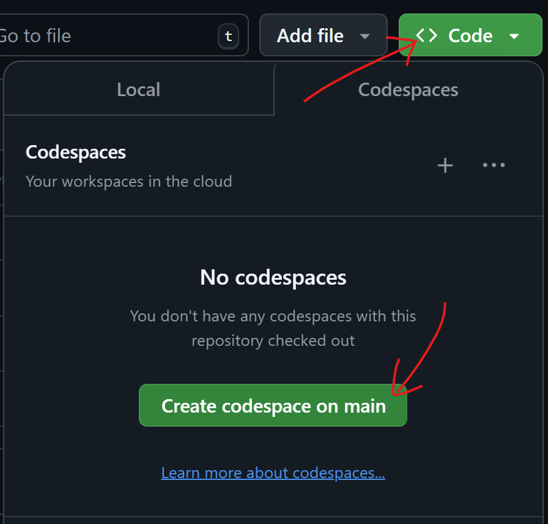

# JEST + CODESPACE

A MVP for the JS sandboxing in LDD Frontend 

## Installation 
1. Have this repository open on your browser 
2. Start codespaces on `main`

3. Install jest via terminal   
`npm install --save-dev jest`

## Usage
1. in terminal
`npm test`
